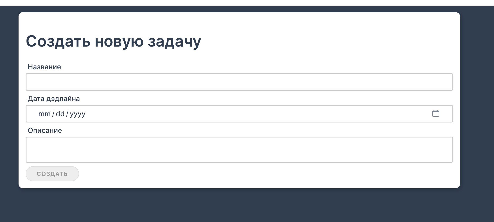
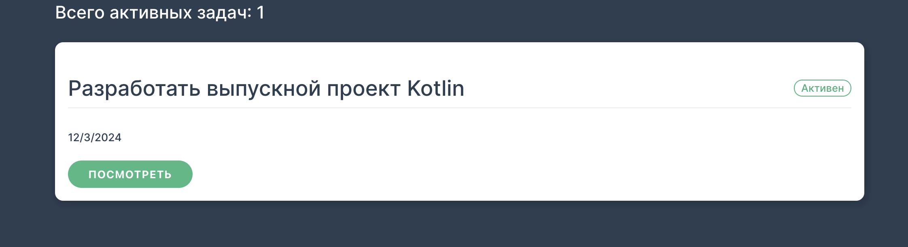
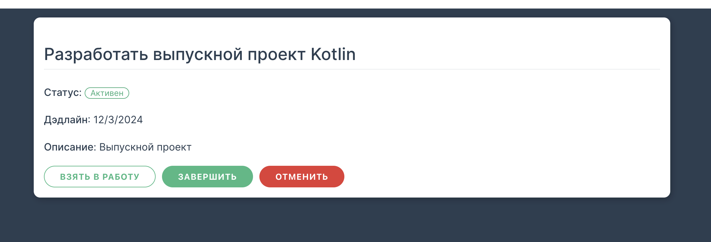

# TODO (PLANNER) PROJECT

Выпускной проект курса
[Kotlin Backend Developer](https://otus.ru/lessons/kotlin/).
Поток курса 2024-05.

## Описание проекта
Приложение для планирования задач (todo), используя микросервисную архитектуру. Проект состоит из нескольких сервисов, которые взаимодействуют между собой для предоставления полной функциональности пользователю.

## Визуальная схема фронтенда

## Документация
1. Маркетинг и аналитика
    1. [Целевая аудитория](./docs/target_audience.md)
    2. [Заинтересанты](./docs/stakeholders.md)
    3. [Пользовательские истории](./docs/component_providers.md)
2. Аналитика:
    1. [Функциональные требования](./docs/functional_requirements.md)
    2. [Нефункциональные требования](./docs/nonfunctional_requirements.md)
3. [Сущности и методы](./docs/entities.md)
4. DevOps
5. [Архитектура](./docs/architecture.md)
6. Тесты
