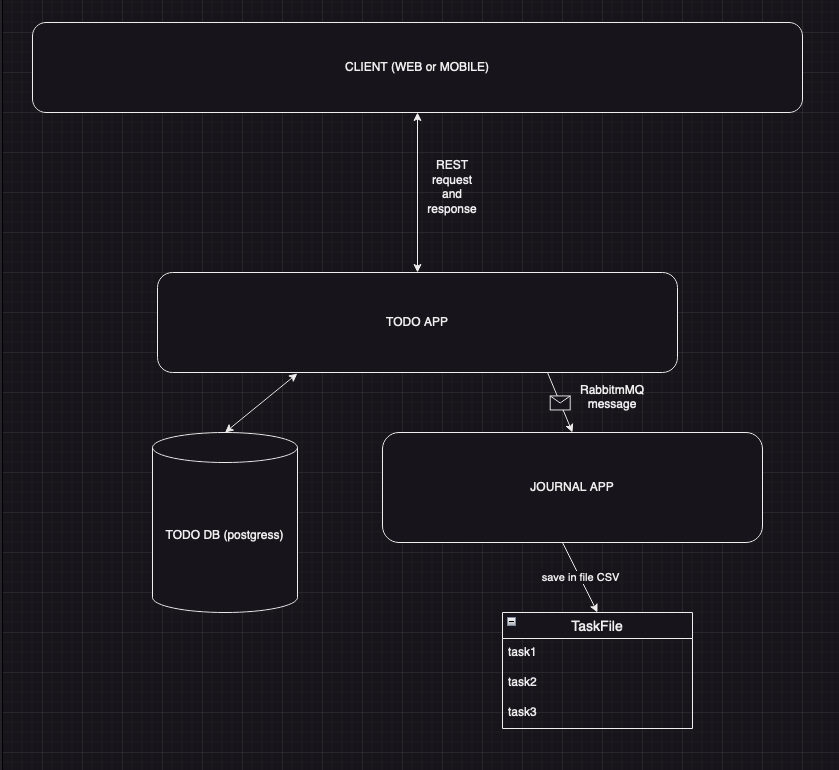

## Архитектура проекта и структура проекта
Проект состоит из следующих сервисов:

### 1. todo-service
- **Технологии:** Spring, Kotlin
- **База данных:** MySQL
- **Функциональность:**
    - Стандартные операции CRUD (создание, чтение, обновление, удаление) для задач.
    - Возможность перевода задачи в различные статусы.
    - REST API для взаимодействия с клиентом.

### 2. notification-service
- **Технологии:** Ktor
- **Функциональность:**
    - Отправляет уведомления на ранее указанную почту в случае выполнения CRUD операций в `todo-service`.
    - Связь с `todo-service` осуществляется с помощью RabbitMQ.

### 3. report-service
- **Технологии:** Ktor
- **Функциональность:**
    - Создает HTML отчет по данным задач.
    - Предоставляет возможность скачивания отчета.
    - Использует WebSocket для передачи данных отчета в реальном времени.
    - Связь с `todo-service` осуществляется с помощью RabbitMQ.

## Схема проекта
